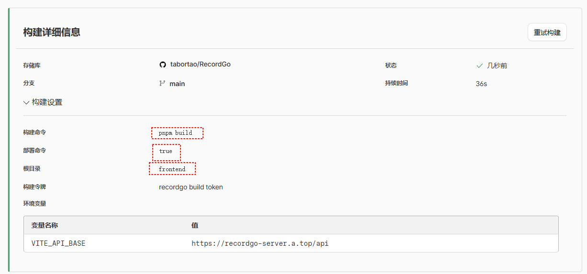

## 后端部署

1. 使用`docker-compose.yml`部署后端服务
2. 配置环境变量
   - `SECRET_KEY`：JWT 密钥
   - `PORT`、`GIN_MODE`、`STORAGE_ROOT`、`DB_PATH`、`PARENT_COINS_SYNC`
3. 挂载持久化目录
   - 主机路径：`./storage`
   - 容器路径：`/app/storage`
4. 启动服务
   - `docker-compose up -d`
5. 访问后端 API
   - 地址：`http://localhost:38048/api`
   - 文档：`http://localhost:38048/api/swagger/index.html`

## 前端部署

推荐配置

- Base directory
  - 填写 frontend
- Build command
  - 使用 pnpm： pnpm install && pnpm build
  - 使用 npm（备用）： npm ci && npm run build
- Publish directory
  - 填写 frontend/dist
- Environment variables
  - VITE_API_BASE=https://recordgo-server.a.top/api

- NODE_VERSION=18 （确保 Netlify 使用兼容 Node 版本）
- 可选： PNPM_VERSION=10 （如你在 Netlify 上使用 pnpm 且需指定版本）

**Dockerfile 内容**

- 基于多阶段构建，仅编译并运行后端服务，暴露 `8080`，持久化 `storage`：
- 放置路径：`backend/Dockerfile`
- 运行入口为生成的二进制 `server`，通过环境变量配置路径与端口

**GitHub Actions 内容**

- 工作流文件：`.github/workflows/build-and-push-recordgo-server.yml`
- 触发条件：推送到 `release/**` 分支或打 `v*.*.*` 标签
- 构建多架构镜像并推送到 Docker Hub 与 GHCR
- 镜像名为 `recordgo-server`（Docker Hub 命名为 `${DOCKER_HUB_NAMESPACE}/recordgo-server`）

**部署与配置步骤**

- 后端 Docker 运行

  - 运行命令示例：
    - `docker run -d --name recordgo-server -p 8080:8080 -e SECRET_KEY="replace-with-your-secret" -e PORT="8080" -e GIN_MODE="release" -e STORAGE_ROOT="/app/storage" -e DB_PATH="/app/storage/database/recordgo.db" -v /host/recordgo/storage:/app/storage yourdockerhub/recordgo-server:stable`
  - 必填环境变量：
    - `SECRET_KEY`：JWT 密钥
  - 推荐环境变量：
    - `PORT`、`GIN_MODE`、`STORAGE_ROOT`、`DB_PATH`、`PARENT_COINS_SYNC`
  - 域名配置：
    - 将 `http://recordgo-server.a.top` 代理到容器监听的 `8080` 端口
    - 为避免前端 HTTPS 与后端 HTTP 的混合内容被浏览器拦截，强烈建议为后端启用 HTTPS（例如通过 Nginx/Cloudflare/Caddy 进行 TLS 终止），使后端域名为 `https://recordgo-server.a.top`

- Netlify 前端部署

  - 在 Netlify “Site settings → Build & deploy → Environment” 添加环境变量：
    - `VITE_API_BASE=https://recordgo-server.a.top/api`
  - 构建命令与目录：
    - Build command: `pnpm install && pnpm build`
    - Publish directory: `frontend/dist`
  - 说明：
    - 前端生产环境会使用 `VITE_API_BASE` 作为 Axios 基地址（`frontend/src/services/http.ts:5-8`），接口路径均为相对路径（如 `'/tasks'`），因此需将该变量指向后端的 `/api` 前缀。
    - 若后端未启用 HTTPS，浏览器会阻止从 `https://recordgo.netlify.com` 到 `http://recordgo-server.a.top` 的请求，请务必启用后端 HTTPS 或使用 Netlify 的代理功能避免跨源与混合内容。

- CORS 配置（确保跨域正常）
  - 请在后端或反向代理层添加 CORS 响应头，至少包含：
    - `Access-Control-Allow-Origin: https://recordgo.netlify.com`
    - `Access-Control-Allow-Methods: GET,POST,PUT,PATCH,DELETE,OPTIONS`
    - `Access-Control-Allow-Headers: Authorization,Content-Type`
    - `Access-Control-Allow-Credentials: true`（如需要）
  - 如果不方便改动后端，可在 Nginx/网关层统一添加上述头部。

**镜像推送配置**

- Docker Hub
  - 在仓库的 Secrets 添加：
    - `DOCKER_HUB_USERNAME`
    - `DOCKER_HUB_TOKEN`
    - `DOCKER_HUB_NAMESPACE`（例如 `yourdockerid`，用于工作流里的 `${{ secrets.DOCKER_HUB_NAMESPACE }}/recordgo-server`）
- GitHub Container Registry (GHCR)
  - 默认使用 `${{ github.token }}` 登录
  - 镜像名：`ghcr.io/<owner>/recordgo-server`

**运行检查**

- 接口健康检查：访问 `https://recordgo-server.a.top/api/health` 返回 `{ code: 0 }`
- 前端请求基地址：
  - 构建后访问 `https://recordgo.netlify.com`，打开浏览器 DevTools，确认所有 API 请求发往 `https://recordgo-server.a.top/api/...` 且状态码为 200
- 存储持久化：
  - 宿主机挂载目录 `/host/recordgo/storage` 下应出现 `database/recordgo.db` 与上传目录结构

**代码参考定位**

- 后端端口与启动：`backend/cmd/server/main.go:35-38`
- 配置加载与必填项：`backend/internal/config/config.go:26-39`
- 静态映射（仅上传目录，确认无前端静态路由）：`backend/internal/router/router.go:22-24`

如果你需要我也为后端加上内置的 CORS 中间件或提供 Nginx/TLS 的示例部署配置，我可以直接补充对应文件与说明。
